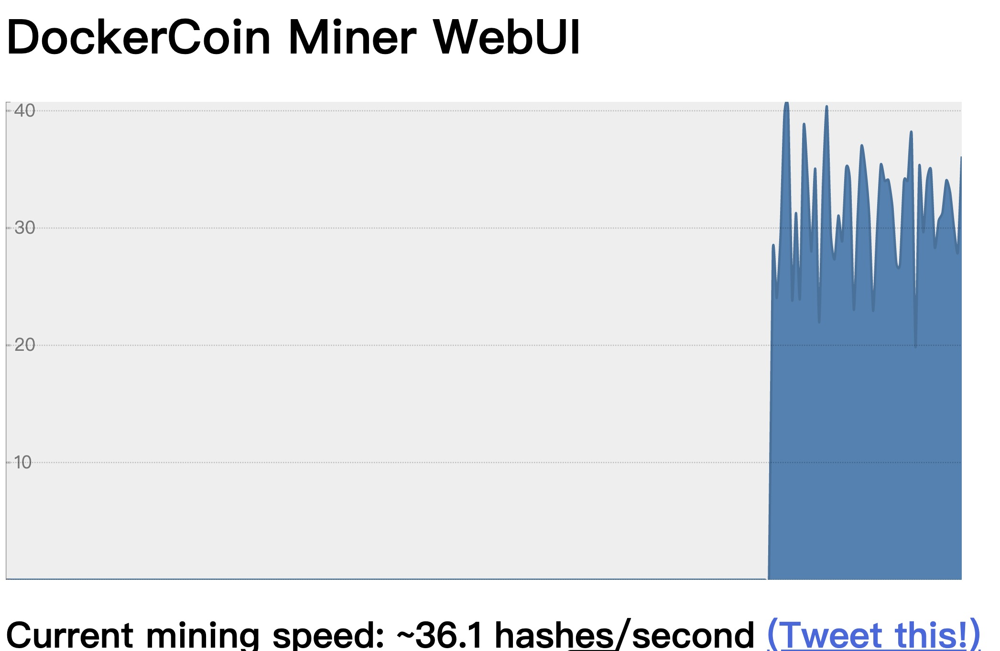

# Assignment-6 Questions

## Basic Information

Name:  QIU Yaowen 

Student ID: 20784389

---

## (2 points) Report the performance of DockerCoins with different number of workers.

(1 point) TODO: Replace <FILL_IN> with the appropriate result.

| # of workers  | 1    | 2    | 3    | 4    | 5    | 10   |
| ------------- | ---- | ---- | ---- | ---- | ---- | ---- |
| hashes/second | 4.0 | 8.0 | 11.9 | 12.0 | 10.0 | 10.0 |

(1 point) When you have 10x workers, how much the performance is improved? Please describe the potential reasons for this phenomenon.

Answer: Compare to 1 workers, only 2.5x performance is improved, which is same as 3 workers. The potential reason is there is at least one worker is relatively weaker than others. It becomes the bottleneck.

## (1 point) Detect latency and find the bottleneck component (rng or hasher).

(0.5 point) TODO: Replace <FILL_IN> with the appropriate result.

| Service      | Hasher | Rng  |
| ------------ | ------ | ---- |
| Average Latency (ms) | 1.3 | 732.9|

(0.5 point) Which service is the bottleneck? 

Answer: Rng

## (1 point) Upload the screenshot of WebUI after setting up the hpa.



## (2 points) Open question: how to reduce the fluctuation of the HPA?

Apart from the autoscaling policy we provided, think about how to reduce the fluctuation of the HPA? Explain your method in details and show how you setup your own HPA.

Answer:
1. The flunctuation will happen when the scaling is processes. we can adjust the speed of scaling to reduce the flunctuation. 

We can Scale Up As Fast As Possible, Scale Down Very Gradually.
```yaml
behavior:
  scaleUp:
    policies:
    - type: Percent
      value: 900
      periodSeconds: 60
  scaleDown:
    policies:
    - type: Pods
      value: 1
      periodSeconds: 600 # (i.e., scale down one pod every 10 min)
```
2.
The “stabilizationWindowSeconds” field is set to 120 seconds. The counterpart of this could be set with this controller-manager flag:
“--horizontal-pod-autoscaler-downscale-stabilization”. With this, we can actually set a cooldown period for scaling up operations. This could make your application’s random spikes more stable for the infrastructure. (Reference: https://www.kloia.com/blog/advanced-hpa-in-kubernetes)
